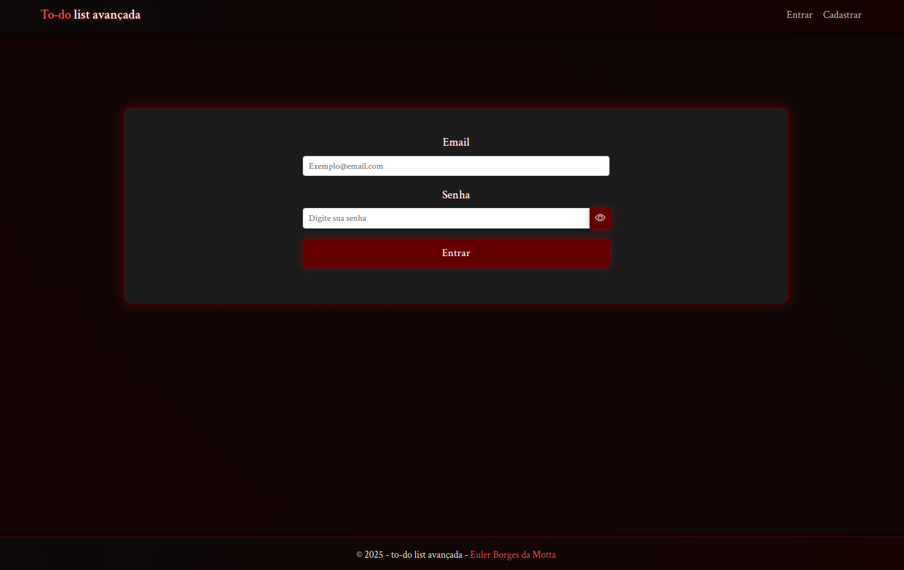
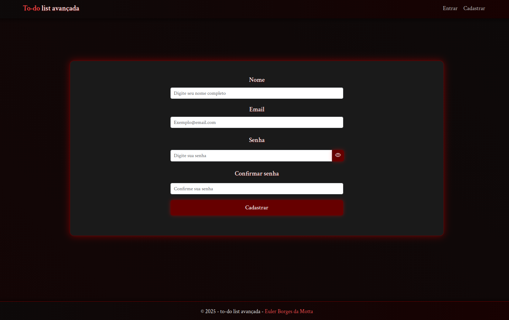
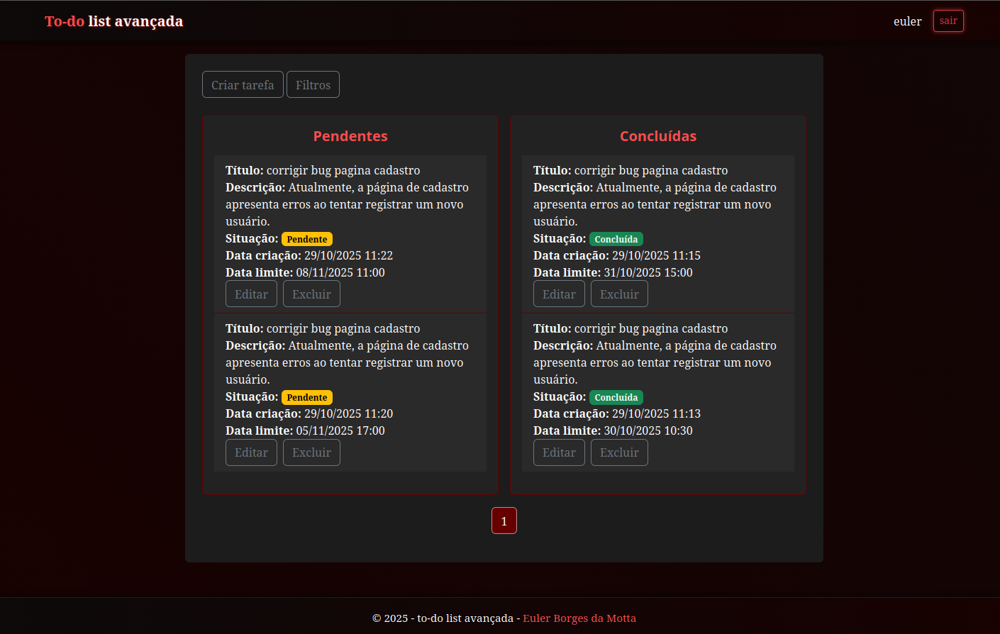

<h1 align="center">Descrição geral do sistema e suas telas</h1>

<p align="center">
  <b>O sistema é uma aplicação de gerenciamento de tarefas que permite criar, editar, filtrar e organizar atividades. Ele utiliza PHP no backend, MySQL para armazenamento e uma interface moderna e responsiva no frontend.</b>
</p>

<h2>⚡ Front-End Organização</h2>
<ul>
    <li>📌 <b>index.php</b> – Página inicial que carrega a aplicação e define o ponto de entrada principal do sistema.</li>
    <li>📌 <b>routes.php</b> – Define as rotas e redirecionamentos das páginas do front-end.</li>
    <li>📌 <b>setup.php</b> – Responsável por conectar com o banco e rodar as migrations.</li>
    <li>📌 <b>pages/</b> – Contém as páginas principais do sistema, como login, dashboard e formulários.</li>
    <li>📌 <b>includes/</b> – Armazena componentes reutilizáveis, como cabeçalhos, rodapés.</li>
    <li>📌 <b>css/</b> – Folhas de estilo responsáveis pelo design e aparência da aplicação.</li>
    <li>📌 <b>js/</b> – Scripts JavaScript que controlam a lógica do front-end e interação com o usuário.</li>
    <li>📌 <b>js/alerts/</b> – Funções para exibição de alertas e mensagens visuais ao usuário.</li>
    <li>📌 <b>js/exceptions/</b> – Tratamento de erros e exceções na camada de interface.</li>
    <li>📌 <b>js/render/</b> – Responsável por renderizar componentes e elementos dinamicamente na tela.</li>
    <li>📌 <b>js/request/</b> – Contém funções para realizar requisições HTTP (fetch/AJAX) ao back-end.</li>
    <li>📌 <b>js/utils/</b> – Funções utilitárias e auxiliares reutilizáveis em todo o front-end.</li>
    <li>📌 <b>js/validade/</b> – Lógica de validação de formulários e campos de entrada.</li>
    <li>📌 <b>js/scrypt/</b> – Scripts gerais.</li> </ul>
</ul>

<h2>⚡ Back-End Organização</h2>
<ul>
    <li>📌 <b>controller/</b> – Camada responsável por receber as requisições.</li> 
    <li>📌 <b>database/</b> – Gerencia a conexão com o banco de dados (PDO) e configurações de acesso.</li> 
    <li>📌 <b>exceptions/</b> – Classes de exceções personalizadas para tratamento de erros específicos.</li> 
    <li>📌 <b>migration/</b> – Scripts responsáveis por criar e atualizar a estrutura das tabelas no banco de dados.</li> 
    <li>📌 <b>repository/</b> – Camada de acesso a dados, responsável por interagir diretamente com o banco (CRUD).</li> 
    <li>📌 <b>response/</b> – Define o formato e estrutura das respostas retornadas ao front-end.</li> 
    <li>📌 <b>services/</b> – Contém a lógica de negócio da aplicação (regras e validações principais).</li> 
    <li>📌 <b>utils/</b> – Funções auxiliares e classes de suporte reutilizáveis por todo o back-end.</li> </ul>
</ul>

<h2>📸 Telas</h2>

<h3 align="center">Tela de login</h3>
<p align="center">
  
</p>

<h3 align="center">Tela de registro</h3>
<p align="center">
  
</p>

<h3 align="center">Tela do dashboard</h3>
<p align="center">
  
  <p align="center">
</p>
</p>

---

<h1 align="center">Passo a passo para utilização</h1>

<h2>Rotas</h2>

<ul>
    <li><b>/login</b> – Responsavel por efetuar o login no sistema.</li> 
    <li><b>/register</b> – Responsavel por registrar os usuarios no sistema.</li>
    <li><b>/dashboard</b> – Responsavel por mostrar, editar, filtrar e excluir tarefas.</li>  
    <li><b>/logout</b> – Responsavel por encerrar a sessão do usuario.</li>
</ul>

Após criar conta e efetuar o login será redirecionado para o `Dashboard` podendo utilizar o sistema e suas funções.

<h1 align="center">Explicação simples de como instalar e rodar o projeto localmente.</h1>

<p align="center">
  <h2>Docker → </h2>
</p>

<p>
  REQUISITO → Ter docker estalado. <a href="https://www.docker.com/" target="_blank">BAIXAR DOCKER</a>
</p>

Clone o repositório
```bash
git clone https://github.com/eulerBM/to-do-list-avancada.git
```
Entre na pasta do projeto
```bash
cd to-do-list-avancada
```
Rode esse comando
```bash
docker-compose up -d
```
Entre no navegador e acesse ⭢ <a href="http://localhost:8000/" target="_blank">http://localhost:8000/</a>

<p align="center">
  <h2>Sem docker →</h2>
</p>

<p>
  REQUISITO 1 → Ter PHP 8.3 <a href="https://www.php.net/downloads.php" target="_blank"> BAIXAR PHP</a>
</p>

<p>
  REQUISITO 2 → Ter MYSQL 8.0 <a href="https://www.mysql.com/downloads/" target="_blank"> BAIXAR MYSQL</a>
</p>

<p>
  REQUISITO 3 → Clone o repositório.

```bash
  git clone https://github.com/eulerBM/to-do-list-avancada.git
```
</p>

<p>
  REQUISITO 4 → Configure o MYSQL.

  No caminho ```public/database/database.php``` configure a conexão com o banco de dados

```bash  
  $host = 'mysql-db'; → Host
  $dbname = 'to-do_list'; → Nome do banco
  $username = 'admin'; → Usuário
  $password = 'admin'; → Senha
```

Se tiver dificuldade com o MYSQL acesse <a href="https://www.youtube.com/watch?v=wgRwITQHszU" target="_blank">MySQL for Beginners</a>

</p>

<p>

  REQUISITO 5 → entre na pasta ```/to-do-list-avancada``` abra o terminal e rode o projeto.

```bash
  php -S localhost:8000 -t public
```
</p>
